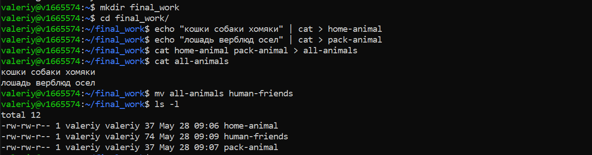
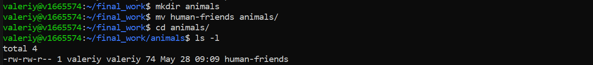
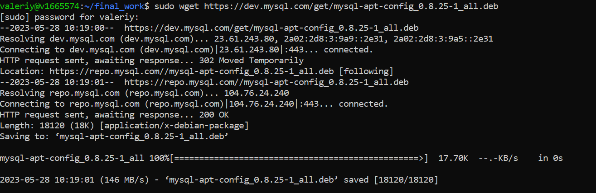
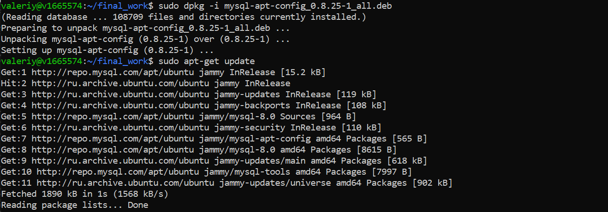
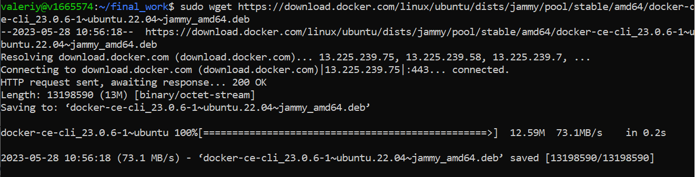
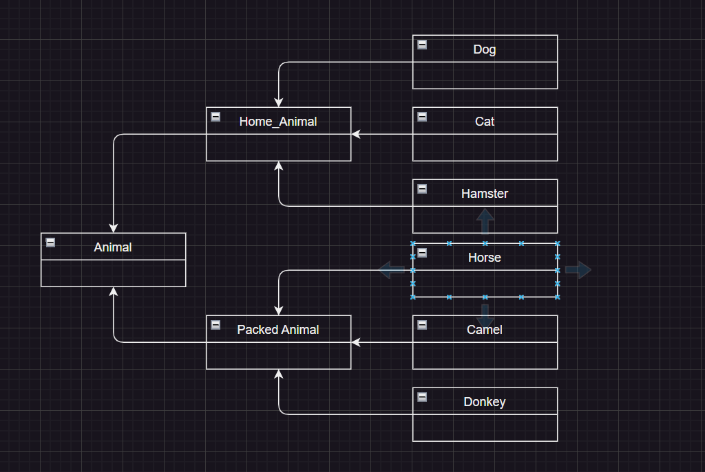

# Итоговая контрольная работа
## Информация о проекте
Необходимо организовать систему учета для питомника в котором живут
домашние и вьючные животные.
1. Используя команду cat в терминале операционной системы Linux, создать
два файла Домашние животные (заполнив файл собаками, кошками,
хомяками) и Вьючные животными заполнив файл Лошадьми, верблюдами и
ослы), а затем объединить их. Просмотреть содержимое созданного файла.
Переименовать файл, дав ему новое имя (Друзья человека).

2. Создать директорию, переместить файл туда.

3. Подключить дополнительный репозиторий MySQL. Установить любой пакет из этого репозитория.

4. Установить и удалить deb-пакет с помощью dpkg.

5. Выложить историю команд в терминале ubuntu

        mkdir final_work
        cd final_work/
        echo "кошки собаки хомяки" | cat > home-animal
        echo "лошадь верблюд осел" | cat > pack-animal
        cat home-animal pack-animal > all-animals
        cat all-animals
        mv all-animals human-friends
        ls -l
        mkdir animals
        mv human-friends animals/
        cd animals/
        ls -l
        sudo wget https://dev.mysql.com/get/mysql-apt-confug_0.8.25-1_all.deb
        sudo dpkg -i mysql-apt-confug_0.8.25-1_all.deb
        sudo apt update
        sudo wget https://download.docker.com/linux/ubuntu/dists/jammy/pool/stable/amd64/docker-ce-cli_23.0.6-1~ubuntu.22.04~jammy_amd64.deb
        sudo dpkg -i docker-ce-cli_23.0.6-1~ubuntu.22.04~jammy_amd64.deb
        sudo dpkg -r docker-ce-cli
6. Нарисовать [диаграмму](./class_diagram.drawio), в которой есть класс родительский класс, домашние
животные и вьючные животные, в составы которых в случае домашних
животных войдут классы: собаки, кошки, хомяки, а в класс вьючные животные
войдут: Лошади, верблюды и ослы).

7. В подключенном MySQL репозитории создать базу данных “Друзья
человека”

        CREATE DATABASE human_friends;
8. Создать таблицы с иерархией из диаграммы в БД

        USE human_friends;
        CREATE TABLE animal_type
        (
                id INT AUTO_INCREMENT PRIMARY KEY, 
                type VARCHAR(20)
        );

        INSERT INTO animal_type (type)
        VALUES ('домашние'), ('вьючные');  

        CREATE TABLE home_animal
        (
                id INT AUTO_INCREMENT PRIMARY KEY,
                kind_name VARCHAR (20),
                type_id INT,
                FOREIGN KEY (type_id) REFERENCES animal_type (id) ON DELETE CASCADE ON UPDATE CASCADE
        );

        INSERT INTO home_animal (kind_name, type_id)
        VALUES ('Кошки', 1), ('Собаки', 1), ('Хомяки', 1);

        CREATE TABLE packed_animal
        (
                id INT AUTO_INCREMENT PRIMARY KEY,
                kind_name VARCHAR (20),
                type_id INT,
                FOREIGN KEY (type_id) REFERENCES animal_type (id) ON DELETE CASCADE ON UPDATE CASCADE
        );

        INSERT INTO packed_animal (kind_name, type_id)
        VALUES ('Лошади', 2), ('Ослы', 2), ('Верблюды', 2);
        

        CREATE TABLE cats
        (       
                id INT AUTO_INCREMENT PRIMARY KEY, 
                name VARCHAR(20), 
                birthday DATE,
                commands VARCHAR(50),
                animal_class_id int,
                Foreign KEY (animal_class_id) REFERENCES home_animal (id) ON DELETE CASCADE ON UPDATE CASCADE
        );

        CREATE TABLE dogs
        (       
                id INT AUTO_INCREMENT PRIMARY KEY, 
                name VARCHAR(20), 
                birthday DATE,
                commands VARCHAR(50),
                animal_class_id int,
                Foreign KEY (animal_class_id) REFERENCES home_animal (id) ON DELETE CASCADE ON UPDATE CASCADE
        );

        CREATE TABLE hamsters
        (       
                id INT AUTO_INCREMENT PRIMARY KEY, 
                name VARCHAR(20), 
                birthday DATE,
                commands VARCHAR(50),
                animal_class_id int,
                Foreign KEY (animal_class_id) REFERENCES home_animal (id) ON DELETE CASCADE ON UPDATE CASCADE
        );

        CREATE TABLE horses
        (       
                id INT AUTO_INCREMENT PRIMARY KEY, 
                name VARCHAR(20), 
                birthday DATE,
                commands VARCHAR(50),
                animal_class_id int,
                Foreign KEY (animal_class_id) REFERENCES packed_animal (id) ON DELETE CASCADE ON UPDATE CASCADE
        );

        CREATE TABLE donkeys
        (       
                id INT AUTO_INCREMENT PRIMARY KEY, 
                name VARCHAR(20), 
                birthday DATE,
                commands VARCHAR(50),
                animal_class_id int,
                Foreign KEY (animal_class_id) REFERENCES packed_animal (id) ON DELETE CASCADE ON UPDATE CASCADE
        );

        CREATE TABLE camels
        (       
                id INT AUTO_INCREMENT PRIMARY KEY, 
                name VARCHAR(20), 
                birthday DATE,
                commands VARCHAR(50),
                animal_class_id int,
                Foreign KEY (animal_class_id) REFERENCES packed_animal (id) ON DELETE CASCADE ON UPDATE CASCADE
        );

9. Заполнить низкоуровневые таблицы именами(животных), командами
которые они выполняют и датами рождения

        INSERT INTO horses (name, birthday, commands, animal_class_id)
        VALUES ('Марта', '2018-08-11', 'Галоп', 1),
        ('Касбек', '2022-11-21', "Стоять", 1);

        INSERT INTO donkeys (name, birthday, commands, animal_class_id)
        VALUES ('Гоша', '2022-06-12', "Вперед", 2),  
        ('Проша', '2021-11-04', "Назад", 2);

        INSERT INTO camels (name, birthday, commands, animal_class_id)
        VALUES ('Камел', '2014-12-02', "Лежать!", 3);

        INSERT INTO cats (name, birthday, commands, animal_class_id)
        VALUES ('Мурка', '2023-09-12', "Кыс-Кыс", 4),  
        ('Тишка', '2011-02-11', "Нельзя!", 4);

        INSERT INTO dogs (name, birthday, commands, animal_class_id)
        VALUES ('Лайка', '2021-01-10', "Фууу!", 5),
        ('Эльза', '2019-04-01', "Фасс!", 5);

        INSERT INTO hamsters (name, birthday, commands, animal_class_id)
        VALUES ('Вася', '2023-02-11', "Есть", 2), 
        ('Геша', '2023-03-11', "Спасть", 2);
10. Удалив из таблицы верблюдов, т.к. верблюдов решили перевезти в другой
питомник на зимовку. Объединить таблицы лошади, и ослы в одну таблицу.

        DELETE * FROM camels;

        SELECT name, birthday, commands FROM horses
        UNION SELECT  name, birthday, commands FROM donkeys;
11. Создать новую таблицу “молодые животные” в которую попадут все
животные старше 1 года, но младше 3 лет и в отдельном столбце с точностью
до месяца подсчитать возраст животных в новой таблице

        CREATE TEMPORARY TABLE all_animals AS 
        SELECT *, 'Лошади' As kind FROM horses
        UNION SELECT *, 'Ослы' AS kind FROM donkeys
        UNION SELECT *, 'Кошки' AS kind FROM cats
        UNION SELECT *, 'Сабаки' AS kind FROM dogs
        UNION SELECT *, 'Хомяки' AS kind FROM hamsters;

        CREATE TABLE young_animal AS
        SELECT name, birthday, commands, kind, TIMESTAMPDIFF(MONTH, Birthday, CURDATE()) AS months
        FROM all_animals WHERE birthday BETWEEN ADDDATE(curdate(), INTERVAL -3 YEAR) AND ADDDATE(CURDATE(), INTERVAL -1 YEAR);
        
        SELECT * FROM young_animal;
12. Объединить все таблицы в одну, при этом сохраняя поля, указывающие на
прошлую принадлежность к старым таблицам.

        SELECT h.name, h.birthday, h.commands, pa.kind_name
        FROM horses h
        LEFT JOIN packed_animals pa ON pa.id = h.animal_class_id
        UNION 
        SELECT dn.name, dn.birthday, dn.commands, pa.kind_name
        FROM donkeys dn
        LEFT JOIN packed_animals pa ON pa.id = dn.animal_class_id
        UNION
        SELECT c.name, c.birthday, c.commands, ha.kind_name
        FROM cats c
        LEFT JOIN home_animals ha ON ha.id = c.animal_class_id
        UNION
        SELECT dg.Name, dg.Birthday, dg.Commands, ha.kind_name
        FROM dogs dg
        LEFT JOIN home_animals ha ON ha.id = d.animal_class_id
        UNION
        SELECT hm.name, hm.birthday, hm.commands, ha.kind_name
        FROM hamsters hm
        LEFT JOIN home_animals ha ON ha.id = hm.animal_class_id;